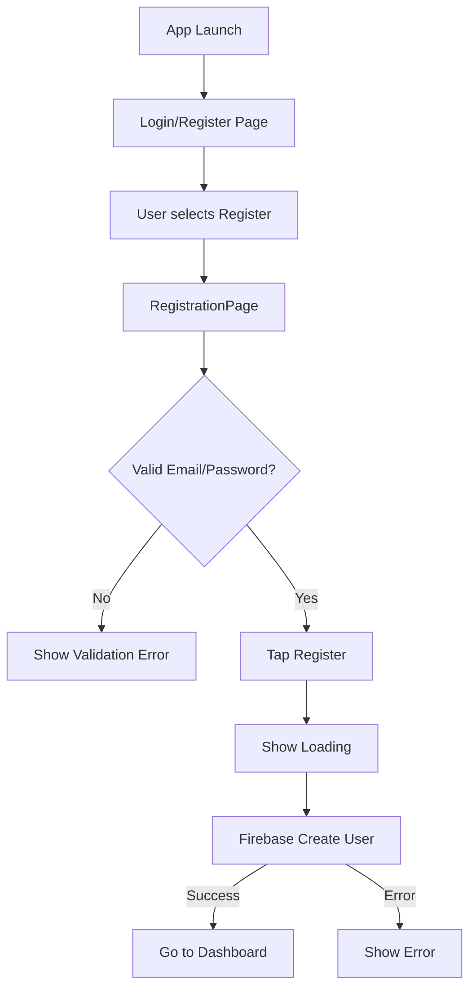
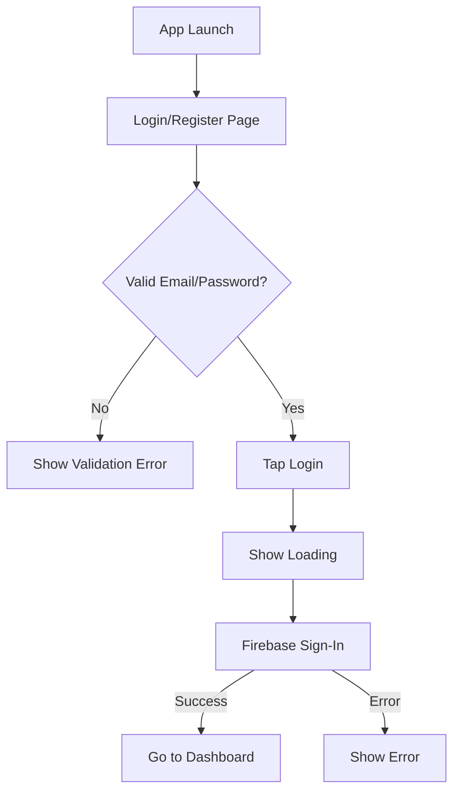
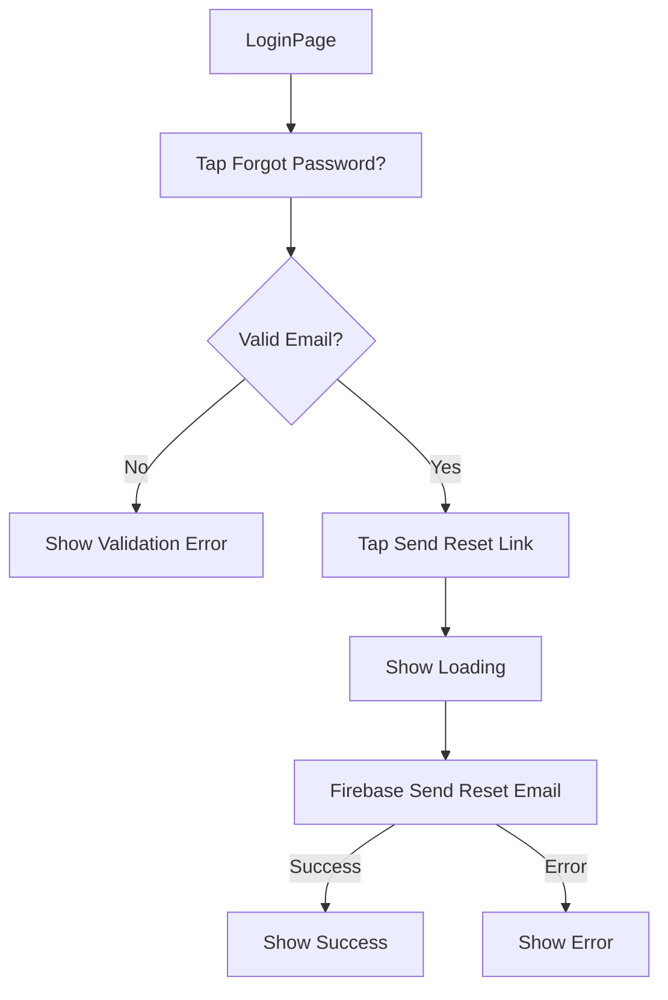
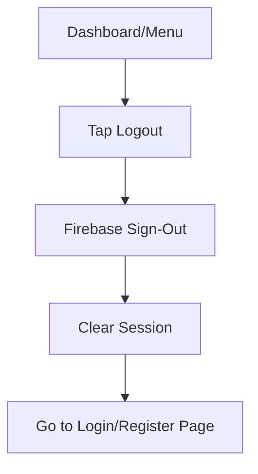
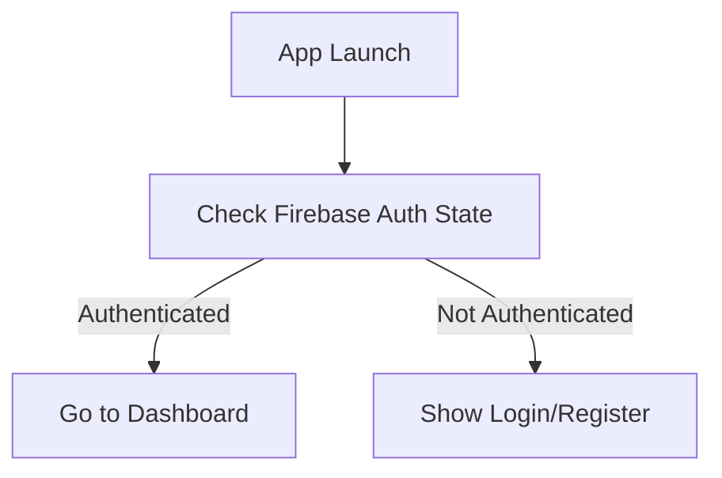

# Authentication & Registration Flows (Firebase)

This document describes the user flows for authentication and registration in the MobileTracker app, using Firebase Authentication. All diagrams are in Mermaid format for easy inclusion in documentation.

---

## 1. Registration Flow

---

## 2. Login Flow

---

## 3. Password Reset Flow

---

## 4. Logout Flow

---

## 5. Session Persistence

---

> Copy these diagrams into your README or documentation for clear, visual user flow representation.
